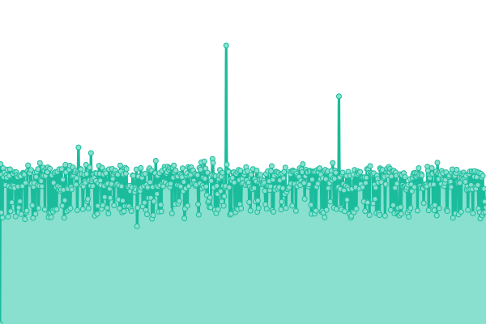
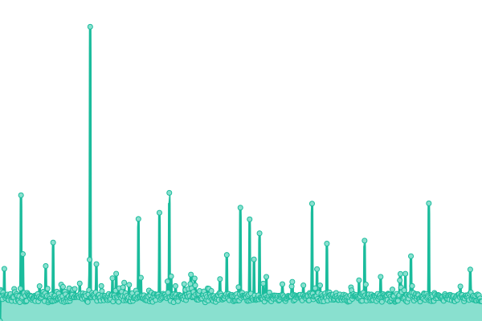
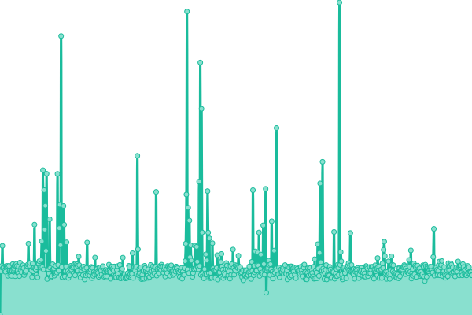
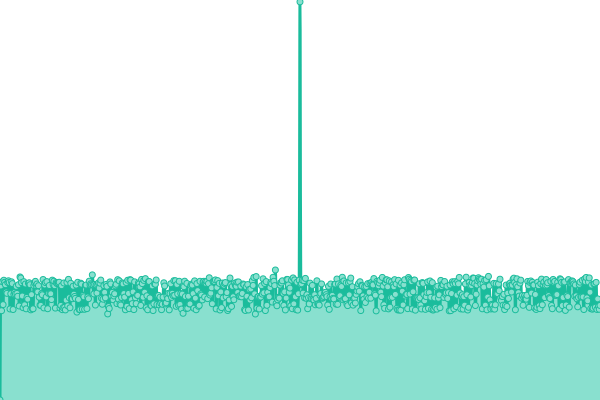
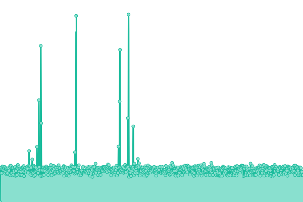
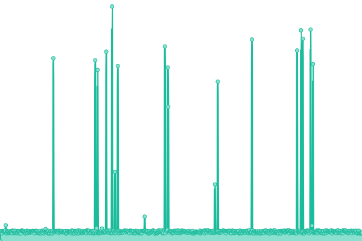
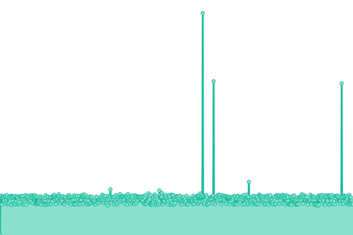
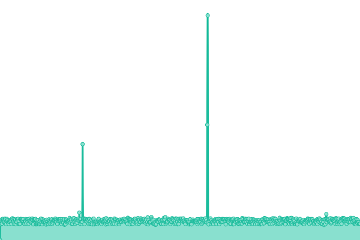
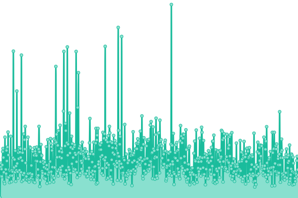

# [📈 Live Status](https://status.waste4change.com): <!--live status--> **🟩 All systems operational**

This repository contains the open-source uptime monitor and status page for [Tech Waste4Change](https://status.waste4change.com), powered by [Upptime](https://github.com/upptime/upptime).

With [Upptime](https://upptime.js.org), you can get your own unlimited and free uptime monitor and status page, powered entirely by a GitHub repository. We use [Issues](https://github.com/waste4change/upptime/issues) as incident reports, [Actions](https://github.com/waste4change/upptime/actions) as uptime monitors, and [Pages](https://status.waste4change.com) for the status page.

<!--start: status pages-->
<!-- This summary is generated by Upptime (https://github.com/upptime/upptime) -->
<!-- Do not edit this manually, your changes will be overwritten -->
<!-- prettier-ignore -->
| URL | Status | History | Response Time | Uptime |
| --- | ------ | ------- | ------------- | ------ |
|  [HOMEPAGE • Landing Page](https://www.waste4change.com) | 🟩 Up | [homepage-landing-page.yml](https://github.com/waste4change/upptime/commits/HEAD/history/homepage-landing-page.yml) | 

 963ms
     
 | 

<a href="https://status.waste4change.com/history/homepage-landing-page">100.00%</a>
    

|  [HOMEPAGE • Blog](https://waste4change.com/blog) | 🟩 Up | [homepage-blog.yml](https://github.com/waste4change/upptime/commits/HEAD/history/homepage-blog.yml) | 

 1575ms
     
 | 

<a href="https://status.waste4change.com/history/homepage-blog">100.00%</a>
    

|  [HOMEPAGE • Short URL](https://w4c.id/shorturl) | 🟩 Up | [homepage-short-url.yml](https://github.com/waste4change/upptime/commits/HEAD/history/homepage-short-url.yml) | 

 1413ms
     
 | 

<a href="https://status.waste4change.com/history/homepage-short-url">0.00%</a>
    

|  [SYW • Admin](https://pwm.waste4change.com/poin/admin) | 🟩 Up | [syw-admin.yml](https://github.com/waste4change/upptime/commits/HEAD/history/syw-admin.yml) | 

 2477ms
     
 | 

<a href="https://status.waste4change.com/history/syw-admin">100.00%</a>
    

|  [SYW • Agent](https://pwm.waste4change.com/poin/agent) | 🟩 Up | [syw-agent.yml](https://github.com/waste4change/upptime/commits/HEAD/history/syw-agent.yml) | 

 1227ms
     
 | 

<a href="https://status.waste4change.com/history/syw-agent">100.00%</a>
    

|  [SYW • User](https://my.waste4change.com) | 🟩 Up | [syw-user.yml](https://github.com/waste4change/upptime/commits/HEAD/history/syw-user.yml) | 

 1373ms
     
 | 

<a href="https://status.waste4change.com/history/syw-user">100.00%</a>
    

|  [SYW • API](https://api.my.waste4change.com) | 🟩 Up | [syw-api.yml](https://github.com/waste4change/upptime/commits/HEAD/history/syw-api.yml) | 

 1004ms
     
 | 

<a href="https://status.waste4change.com/history/syw-api">57.41%</a>
    

|  [SYW • API 2](https://apisyw.my.waste4change.com/api) | 🟩 Up | [syw-api-2.yml](https://github.com/waste4change/upptime/commits/HEAD/history/syw-api-2.yml) | 

 1252ms
     
 | 

<a href="https://status.waste4change.com/history/syw-api-2">89.53%</a>
    

|  [W4C-S • Admin](https://admin.waste4change.com) | 🟩 Up | [w4-c-s-admin.yml](https://github.com/waste4change/upptime/commits/HEAD/history/w4-c-s-admin.yml) | 

 1544ms
     
 | 

<a href="https://status.waste4change.com/history/w4-c-s-admin">100.00%</a>
    

|  [W4C-S • Api](https://api.waste4change.com) | 🟩 Up | [w4-c-s-api.yml](https://github.com/waste4change/upptime/commits/HEAD/history/w4-c-s-api.yml) | 

 727ms
     
 | 

<a href="https://status.waste4change.com/history/w4-c-s-api">100.00%</a>
    

|  [W4C-S • Operator](https://operator.waste4change.com) | 🟩 Up | [w4-c-s-operator.yml](https://github.com/waste4change/upptime/commits/HEAD/history/w4-c-s-operator.yml) | 

 139ms
     
 | 

<a href="https://status.waste4change.com/history/w4-c-s-operator">100.00%</a>
    

<!--end: status pages-->

[**Visit our status website →**](https://status.waste4change.com)

## 📄 License

- Powered by: [Upptime](https://github.com/upptime/upptime)
- Code: [MIT](./LICENSE) © [Tech Waste4Change](https://status.waste4change.com)
- Data in the `./history` directory: [Open Database License](https://opendatacommons.org/licenses/odbl/1-0/)
